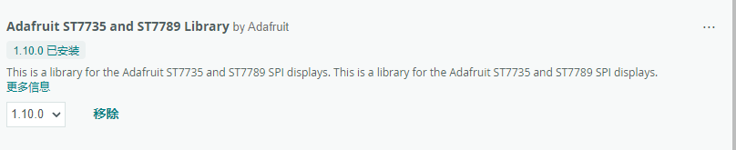

### 简介
这是一个使用Arduino UNO结合 TFT库 驱动ST7735S型号屏幕的例程
### 操作流程
- 屏幕上有8个引脚，下面表格中介绍了引脚的接线方法

  | 屏幕引脚 |                     用法                     | Arduino引脚              |
  | :------: | :------------------------------------------: | :----------------------- |
  |   GND    |                     接地                     | GDN                      |
  |   VCC    |                     供电                     | 5V                       |
  |   SCL    |             （Serial Clock）时钟             | 13(可能和单片机本身有关) |
  |   SDA    |            （Serial Data）数据线             | 11(同上)                 |
  |   RES    |                     重置                     | 可任意定义               |
  |    DC    | （Data/Command）用于切换输出的是命令还是数据 | 可任意定义               |
  |    CS    |              (Chip Select)片选               | 可任意定义               |
  |   BLK    |              屏幕背光(用处不大)              | 3.3V                     |

- 因为Arduino中有TFT库和SPI库，需要根据教程安装下面这个库，以及自动关联的几个库，到这里就做好了准备工作
- 最后根据TFT官方教程编写程序即可实现屏幕驱动

### 参考资料

[TFT - Arduino Reference](https://www.arduino.cc/reference/en/libraries/tft/)

[【Arduino進階教學課程】 驅動ST7735 TFT 全彩顯示螢幕 | 米羅科技文創學院 (mirotek.com.tw)](https://shop.mirotek.com.tw/arduino/arduino-st7735/)
